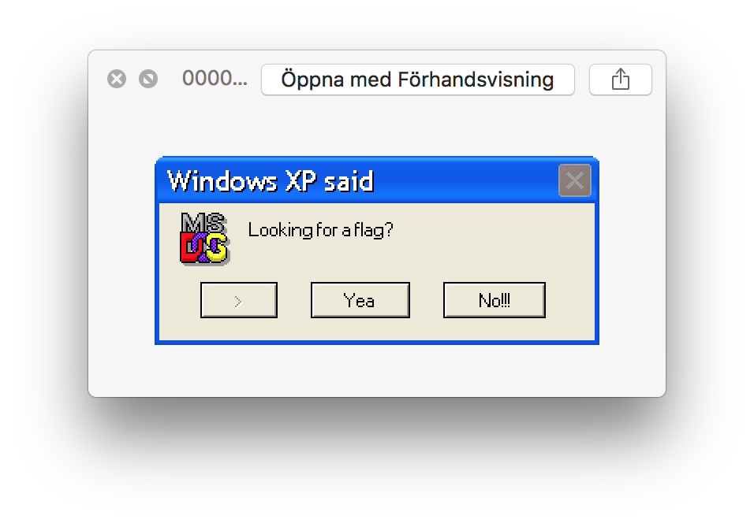

# Hydra

We got this png file of a hydra. 
The size of 5,1 MB tells that it is more than meets the eye.
Running `strings` on it reveals at bunch of stuff:
```
LINUX                           CDROM
                                                                                                                                                                                                                                                                                                                                                                                                GENISOIMAGE ISO 9660/HFS FILESYSTEM CREATOR (C) 1993 E.YOUNGDALE (C) 1997-2006 J.PEARSON/J.SCHILLING (C) 2006-2007 CDRKIT TEAM                                                                                                                 2019051714090300
2019051714090300
0000000000000000
2019051714090300

CD001
BEA01
NSR02
TEA01
CDROM
5CDEA45F00000F97
OSTA Compressed Unicode
OSTA Compressed Unicode
*genisoimage
*UDF LV Info
OSTA Compressed Unicode
CDROM
*genisoimage
+NSR02
*genisoimage
OSTA Compressed Unicode
CDROM
*OSTA UDF Compliant
*genisoimage
CDROM
5CDEA45F00000FE0
OSTA Compressed Unicode
OSTA Compressed Unicode
*genisoimage
*UDF LV Info
OSTA Compressed Unicode
CDROM
*genisoimage
+NSR02
*genisoimage
OSTA Compressed Unicode
CDROM
*OSTA UDF Compliant
*genisoimage
*genisoimage
OSTA Compressed Unicode
CDROM
OSTA Compressed Unicode
CDROM
*OSTA UDF Compliant
*genisoimage
flag.txt
*genisoimage
FLAG.TXT;1
Looking for flag....
%PDF
1337.pdf
Exif
7/j{
TG-m
%%EOF
IEND
```

Okay so the file is fishy and running `foremost` on it gives the following output:
```
$ tree
.
├── audit.txt
├── gif
│   └── 00008375.gif
└── png
    └── 00008369.png
```

The png file could be opened and gave

The gif file could not be opened so we tried to dig deeper in it.
We spent a lot of time trying to get something useful out of the gif file with multiple tools until we realised that we had neglected the png file.

Running strings on it revelead this funny thing:

```
<?xpacket begin='
' id='W5M0MpCehiHzreSzNTczkc9d'?>
<x:xmpmeta xmlns:x='adobe:ns:meta/' x:xmptk='Image::ExifTool 10.80'>
<rdf:RDF xmlns:rdf='http://www.w3.org/1999/02/22-rdf-syntax-ns#'>
 <rdf:Description rdf:about=''
  xmlns:dc='http://purl.org/dc/elements/1.1/'>
  <dc:rights>
   <rdf:Alt>
    <rdf:li xml:lang='x-default'>Copyright</rdf:li>
   </rdf:Alt>
  </dc:rights>
 </rdf:Description>
</rdf:RDF>
</x:xmpmeta>
<?xpacket end='r'?>
IEND
```
Aha, exiftool meaning metadata in the file!

Running exiftool gave:
```
exiftool png/00008369.png
ExifTool Version Number         : 11.01
File Name                       : 00008369.png
Directory                       : png
File Size                       : 2.6 kB
File Modification Date/Time     : 2019:05:24 20:38:18+02:00
File Access Date/Time           : 2019:05:24 20:41:45+02:00
File Inode Change Date/Time     : 2019:05:24 20:38:18+02:00
File Permissions                : rw-r--r--
File Type                       : PNG
File Type Extension             : png
MIME Type                       : image/png
Image Width                     : 282
Image Height                    : 120
Bit Depth                       : 8
Color Type                      : Palette
Compression                     : Deflate/Inflate
Filter                          : Adaptive
Interlace                       : Noninterlaced
Palette                         : (Binary data 210 bytes, use -b option to extract)
Transparency                    : 0
Copyright Notice                : frps{Fj0eqs15u_sy4t_u1qq3a_1a_z3g4}
Application Record Version      : 4
XMP Toolkit                     : Image::ExifTool 10.80
Rights                          : Copyright
Image Size                      : 282x120
Megapixels                      : 0.034
```

The copyright notice looks like the flag but it is scrambeled.
Testing with regular rot13 gave the flag:
`secf{Sw0rdf15h_fl4g_h1dd3n_1n_m3t4}`

Nice forensic challenge!

Takeaways:
* always test all files
* understand the joke