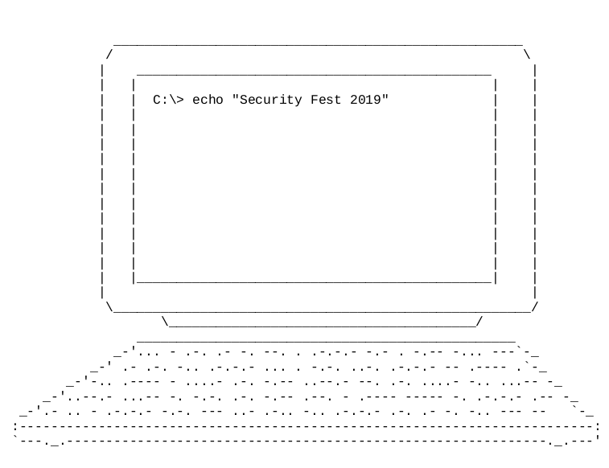

# Signal
A pdf file was downloaded called `signal.pdf`



We quickly realized that there was a morse code signal visible in the text.

```... - .-. .- -. --. . .-.-.- -.- . -.-- -... --- .- .-. -.. .-.-.- ... . -.-. ..-. .-.-.- -- .---- . -.. .---- - ....- .-. -.-- ..--.- --. .-. ....- -.. ...-- ..--.- ...-- -. -.-. .-. -.-- .--. - .---- ----- -. .-.-.- .-- .- .. - .-.-.- -.-. --- ..- .-.. -.. .-.-.- .-. .- -. -.. --- --``` 

was translated using [CyberChef](https://gchq.github.io/CyberChef/#recipe=From_Morse_Code('Space','Line%20feed')To_Lower_case()&input=Li4uIC0gLi0uIC4tIC0uIC0tLiAuIC4tLi0uLSAtLi0gLiAtLi0tIC0uLi4gLS0tIC4tIC4tLiAtLi4gLi0uLS4tIC4uLiAuIC0uLS4gLi4tLiAuLS4tLi0gLS0gLi0tLS0gLi0uLiAuLS0tLSAtIC4uLi4tIC4tLiAtLi0tIC4uLS0uLSAtLS4gLi0uIC4uLi4tIC0uLiAuLi4tLSAgLi4tLS4tIC4uLi0tIC0uIC0uLS4gLi0uIC0uLS0gLi0tLiAtIC4tLS0tIC0tLS0tIC0uIC4tLi0uLSAuLS0gLi0gLi4gLSAuLS4tLi0gLS4tLiAtLS0gLi4tIC4tLi4gLS4uIC4tLi0uLSAuLS4gLi0gLS4gLS4uIC0tLSAtLQo) to:

`strange.keyboard.secf.m1ed1t4ry_gr4d3_3ncrypt10n.wait.could.random`

The flag was required to be in lower case to pass.